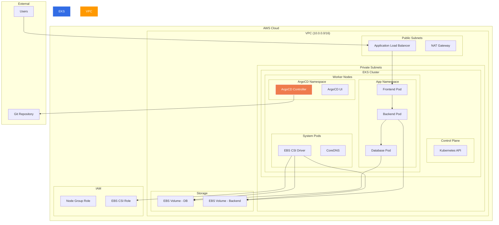
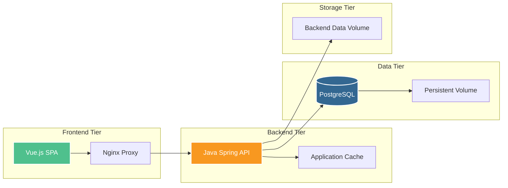
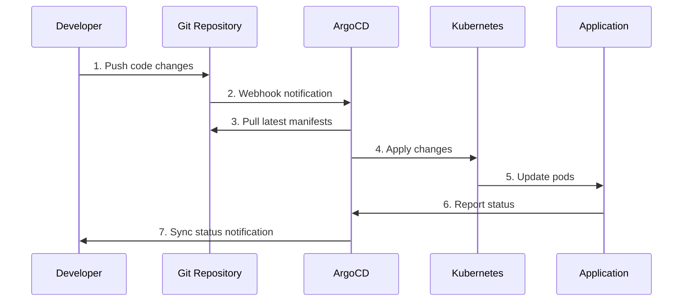
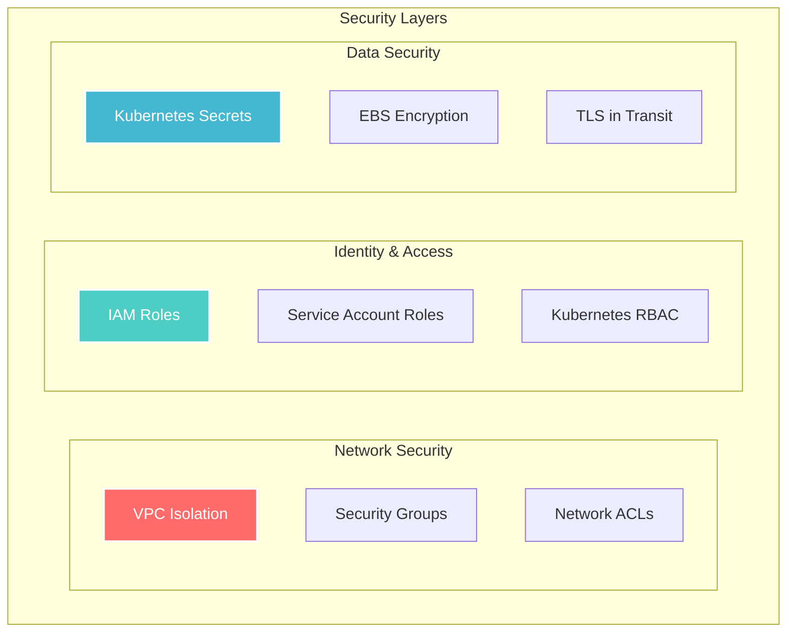

# 🚀 GitOps Infrastructure for Dependency Track

<div align="center">


**Production-ready GitOps infrastructure for deploying Dependency Track on AWS EKS**

[🏗️ Architecture](#-architecture) • [🚀 Quick Start](#-quick-start) • [📖 Documentation](#-table-of-contents) • [🔧 Configuration](#-configuration)

</div>

---

## 📖 Table of Contents

- [🚀 GitOps Infrastructure for Dependency Track](#-gitops-infrastructure-for-dependency-track)
  - [📖 Table of Contents](#-table-of-contents)
  - [🏗️ Architecture](#️-architecture)
    - [Infrastructure Overview](#infrastructure-overview)
    - [Application Architecture](#application-architecture)
    - [GitOps Workflow](#gitops-workflow)
  - [🚀 Quick Start](#-quick-start)
    - [Prerequisites](#prerequisites)
    - [Infrastructure Deployment](#infrastructure-deployment)
    - [Application Deployment](#application-deployment)
  - [📁 Project Structure](#-project-structure)
  - [🔧 Configuration](#-configuration)
    - [Terraform Variables](#terraform-variables)
    - [Kustomize Overlays](#kustomize-overlays)
  - [🛠️ Operations](#️-operations)
    - [Accessing Services](#accessing-services)
    - [Monitoring](#monitoring)
    - [Troubleshooting](#troubleshooting)
  - [🔒 Security](#-security)
    - [Security Features Implemented](#security-features-implemented)
    - [Security Architecture](#security-architecture)
    - [Security Best Practices](#security-best-practices)
  - [📊 Cost Optimization](#-cost-optimization)
    - [Current Cost-Saving Measures](#current-cost-saving-measures)
    - [Infrastructure Costs (Estimated)](#infrastructure-costs-estimated)
    - [Additional Optimization Options](#additional-optimization-options)
  - [🤝 Contributing](#-contributing)
    - [Development Workflow](#development-workflow)
    - [Guidelines](#guidelines)
    - [Adding New Environments](#adding-new-environments)
  - [📋 Terraform Outputs](#-terraform-outputs)
  - [🎯 Quick Commands Reference](#-quick-commands-reference)

---

## 🏗️ Architecture

### Infrastructure Overview



### Application Architecture



### GitOps Workflow



---

## 🚀 Quick Start

### Prerequisites

- AWS CLI configured with appropriate permissions
- Terraform >= 1.0
- kubectl >= 1.21
- Git

### Infrastructure Deployment

1. **Clone the repository**
   ```bash
   git clone <repository-url>
   cd Project-Infra
   ```

2. **Deploy Terraform infrastructure**
   ```bash
   cd terra
   
   # Copy and customize variables
   cp terraform.tfvars.example terraform.tfvars
   # Edit terraform.tfvars with your values
   
   # Initialize Terraform
   terraform init
   
   # Plan the deployment
   terraform plan
   
   # Apply the infrastructure
   terraform apply
   ```

3. **Configure kubectl**
   ```bash
   aws eks update-kubeconfig --region us-east-1 --name abdu-gitops-cluster
   ```

### Application Deployment

4. **Install ArgoCD**
   ```bash
   # Create ArgoCD namespace
   kubectl create namespace argocd
   
   # Install ArgoCD
   kubectl apply -n argocd -f https://raw.githubusercontent.com/argoproj/argo-cd/stable/manifests/install.yaml
   
   # Wait for pods to be ready
   kubectl get pods -n argocd --watch
   ```

5. **Access ArgoCD UI**
   ```bash
   # Get admin password
   kubectl -n argocd get secret argocd-initial-admin-secret -o jsonpath="{.data.password}" | base64 -d
   
   # Port forward to access UI
   kubectl port-forward svc/argocd-server -n argocd 8080:443 &
   ```
   
   Open https://localhost:8080 in browser
   - Username: `admin`
   - Password: [from command above]

6. **Deploy applications**
   ```bash
   cd ../infra-gitops
   ./scripts/deploy.sh
   ```

---

## 📁 Project Structure

```
Project-Infra/
├── 📁 terra/                          # Terraform Infrastructure
│   ├── 📄 main.tf                     # Main infrastructure resources
│   ├── 📄 variables.tf                # Variable definitions
│   ├── 📄 outputs.tf                  # Output definitions
│   └── 📄 terraform.tfvars.example    # Example variables
│
├── 📁 infra-gitops/                   # Kubernetes Manifests
│   ├── 📁 argo-apps/                 # ArgoCD Applications
│   │   ├── 📄 project.yaml           # ArgoCD Project
│   │   └── 📄 dependency-track-dev.yaml
│   │
│   ├── 📁 base/                       # Base Kubernetes resources
│   │   ├── 📄 kustomization.yaml
│   │   ├── 📁 frontend/               # Frontend manifests
│   │   ├── 📁 backend/                # Backend manifests
│   │   ├── 📁 database/               # Database manifests
│   │   ├── 📁 secrets/                # Secret templates
│   │   └── 📁 storage/                # PVC definitions
│   │
│   ├── 📁 overlays/                   # Environment-specific configs
│   │   └── 📁 dev/                    # Development environment
│   │       ├── 📄 kustomization.yaml
│   │       ├── 📄 patch.yaml
│   │       └── 📄 nginx-config-patch.yaml
│   │
│   └── 📁 scripts/                    # Deployment scripts
│       └── 📄 deploy.sh
│
└── 📄 README.md                       # This file
```

---

## 🔧 Configuration

### Terraform Variables

The infrastructure is fully configurable through Terraform variables. Here's a comprehensive overview:

| Variable | Description | Default | Type |
|----------|-------------|---------|------|
| `region` | AWS region | `us-east-1` | string |
| `aws_profile` | AWS CLI profile | `terra-abdu` | string |
| `cluster_name` | EKS cluster name | `abdu-gitops-cluster` | string |
| `cluster_version` | Kubernetes version | `1.33` | string |
| `node_instance_types` | EC2 instance types | `["t3.small"]` | list(string) |
| `node_desired_size` | Desired number of nodes | `2` | number |
| `node_min_size` | Minimum number of nodes | `1` | number |
| `node_max_size` | Maximum number of nodes | `3` | number |
| `vpc_cidr` | VPC CIDR block | `10.0.0.0/16` | string |
| `availability_zones` | AZs for the VPC | `["us-east-1a", "us-east-1b"]` | list(string) |
| `enable_ebs_csi_driver` | Enable EBS CSI driver | `true` | bool |

**Example configuration:**
```bash
cd terra
cp terraform.tfvars.example terraform.tfvars
# Edit terraform.tfvars with your values
terraform plan
terraform apply
```

### Kustomize Overlays

The project uses **Kustomize** for environment-specific configurations:

- **Base**: Common resources shared across environments
- **Dev Overlay**: Development-specific patches and configurations
- **Future**: Production overlay can be added for prod-specific configs

**Key Dev Environment Modifications:**
- ✅ Reduced replica counts (cost optimization)
- ✅ Smaller resource requests/limits
- ✅ Development-specific environment variables
- ✅ Smaller persistent volume sizes (2Gi vs 20Gi)
- ✅ Environment-specific service names with `dev-` prefix

---

## 🛠️ Operations

### Accessing Services

| Service | Access Method | URL/Command |
|---------|---------------|-------------|
| **ArgoCD UI** | Port Forward | `kubectl port-forward svc/argocd-server -n argocd 8080:443` |
| **Dependency Track** | LoadBalancer | `kubectl get svc -n dependency-track-dev` |
| **Kubernetes API** | kubectl | `kubectl cluster-info` |

### Monitoring

**Check deployment status:**
```bash
# ArgoCD applications
kubectl get applications -n argocd

# All resources in dev environment
kubectl get all -n dependency-track-dev

# Persistent volumes
kubectl get pv,pvc -n dependency-track-dev

# Check node status
kubectl get nodes

# Resource usage
kubectl top nodes
kubectl top pods -n dependency-track-dev
```

### Troubleshooting

**Common issues and solutions:**

1. **EBS volumes not provisioning**
   ```bash
   # Check EBS CSI driver
   kubectl get pods -n kube-system | grep ebs-csi
   
   # Check IAM permissions
   kubectl describe pvc -n dependency-track-dev
   
   # Check events
   kubectl get events -n dependency-track-dev --sort-by='.lastTimestamp'
   ```

2. **ArgoCD sync issues**
   ```bash
   # Check application status
   kubectl describe application dependency-track-dev -n argocd
   
   # Manual sync via kubectl
   kubectl patch application dependency-track-dev -n argocd --type merge -p '{"operation":{"sync":{}}}'
   ```

3. **Pod startup failures**
   ```bash
   # Check pod logs
   kubectl logs -f deployment/dev-dependency-track-backend -n dependency-track-dev
   
   # Check pod description
   kubectl describe pod <pod-name> -n dependency-track-dev
   
   # Check resource constraints
   kubectl describe nodes
   ```

4. **Networking issues**
   ```bash
   # Test service connectivity
   kubectl exec -it <pod-name> -n dependency-track-dev -- nslookup dev-dependency-track-database
   
   # Check services
   kubectl get svc -n dependency-track-dev
   
   # Check endpoints
   kubectl get endpoints -n dependency-track-dev
   ```

---

## 🔒 Security

### Security Features Implemented

- ✅ **Network Isolation**: Private subnets for worker nodes
- ✅ **RBAC**: ArgoCD project-based access control
- ✅ **IRSA**: IAM Roles for Service Accounts (EBS CSI driver)
- ✅ **Secrets Management**: Kubernetes secrets for sensitive data
- ✅ **Multi-AZ Deployment**: High availability and fault tolerance
- ✅ **VPC Flow Logs**: Network traffic monitoring (can be enabled)

### Security Architecture



### Security Best Practices

1. **Principle of Least Privilege**: Each component has minimal required permissions
2. **Network Segmentation**: Multi-tier architecture with proper isolation
3. **Secrets Rotation**: Regular rotation of database passwords and certificates
4. **Image Security**: Use of official, maintained container images
5. **Audit Logging**: EKS control plane logging enabled

---

## 📊 Cost Optimization

### Current Cost-Saving Measures

| Component | Optimization | Est. Monthly Savings |
|-----------|--------------|---------------------|
| **EKS Nodes** | t3.small instances | ~$50 vs t3.medium |
| **Dev Environment** | Single replica | ~50% resource usage |
| **Storage** | gp2 volumes, right-sized | ~$20 optimized sizing |
| **Load Balancer** | Shared ALB | ~$15 vs multiple ELBs |

### Infrastructure Costs (Estimated)

| Resource | Monthly Cost | Notes |
|----------|-------------|-------|
| EKS Control Plane | $73 | Managed by AWS |
| EC2 Instances (2x t3.small) | ~$30 | Spot pricing available |
| EBS Volumes | ~$5 | 4Gi total across environments |
| NAT Gateway | ~$45 | Required for private subnets |
| Load Balancer | ~$20 | Application Load Balancer |
| **Total** | **~$173/month** | **Development environment** |

### Additional Optimization Options

- **Spot Instances**: 60-70% cost reduction for non-production
- **Horizontal Pod Autoscaling**: Automatic scaling based on usage
- **Vertical Pod Autoscaling**: Right-sizing based on actual usage  
- **Cluster Autoscaler**: Automatic node scaling
- **Reserved Instances**: 20-40% savings for predictable workloads

---

## 🤝 Contributing

### Development Workflow

1. **Fork the repository**
2. **Create a feature branch**
   ```bash
   git checkout -b feature/your-feature-name
   ```
3. **Make changes and test locally**
4. **Commit with conventional commits**
   ```bash
   git commit -m "feat: add new monitoring dashboard"
   ```
5. **Submit a pull request**
6. **ArgoCD will automatically sync approved changes**

### Guidelines

- Follow Kubernetes best practices
- Use proper resource limits and requests
- Document configuration changes
- Test in development environment first
- Follow the existing code style and patterns

### Adding New Environments

To add a new environment (e.g., staging):

1. **Create overlay directory**
   ```bash
   mkdir -p infra-gitops/overlays/staging
   ```

2. **Create kustomization.yaml**
   ```yaml
   apiVersion: kustomize.config.k8s.io/v1beta1
   kind: Kustomization
   namespace: dependency-track-staging
   resources:
   - ../../base
   namePrefix: staging-
   # ... other configurations
   ```

3. **Create ArgoCD application**
   ```bash
   cp argo-apps/dependency-track-dev.yaml argo-apps/dependency-track-staging.yaml
   # Update namespace and source path
   ```

---

## 📋 Terraform Outputs

After successful deployment, Terraform provides useful outputs:

```bash
# Get cluster connection info
terraform output kubectl_config_command

# Get cluster endpoint
terraform output cluster_endpoint

# Get all outputs
terraform output
```

**Key Outputs:**
- `cluster_name`: EKS cluster name
- `cluster_endpoint`: Kubernetes API endpoint
- `vpc_id`: VPC identifier
- `kubectl_config_command`: Ready-to-use kubectl config command

---

<div align="center">

## 🎯 Quick Commands Reference

| Task | Command |
|------|---------|
| **Deploy Infrastructure** | `cd terra && terraform apply` |
| **Update kubeconfig** | `aws eks update-kubeconfig --region us-east-1 --name abdu-gitops-cluster` |
| **Deploy Applications** | `cd infra-gitops && ./scripts/deploy.sh` |
| **Access ArgoCD** | `kubectl port-forward svc/argocd-server -n argocd 8080:443` |
| **Check App Status** | `kubectl get all -n dependency-track-dev` |
| **View Logs** | `kubectl logs -f deployment/dev-dependency-track-backend -n dependency-track-dev` |
| **Scale Application** | `kubectl scale deployment dev-dependency-track-backend --replicas=2 -n dependency-track-dev` |

---

**Built with ❤️ using Kubernetes, Terraform, and GitOps principles**

*This infrastructure follows cloud-native best practices and is ready for production workloads*

[⬆️ Back to Top](#-gitops-infrastructure-for-dependency-track)

</div>